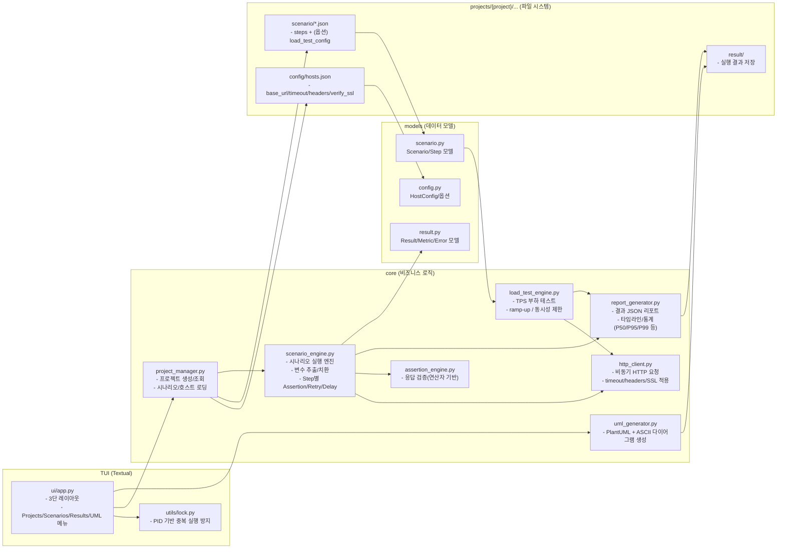
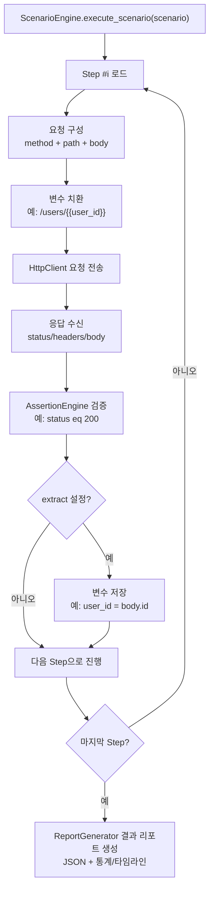
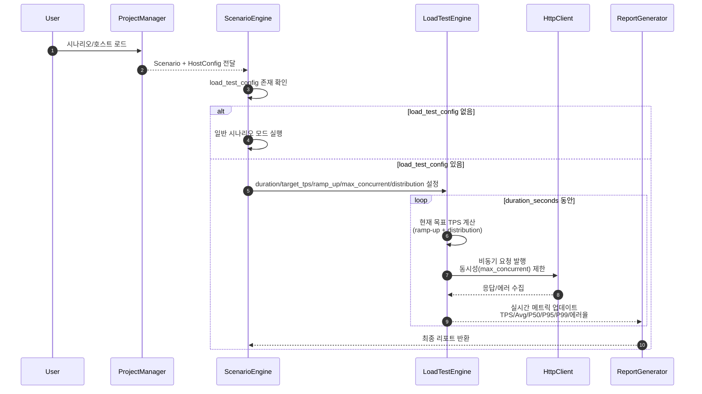
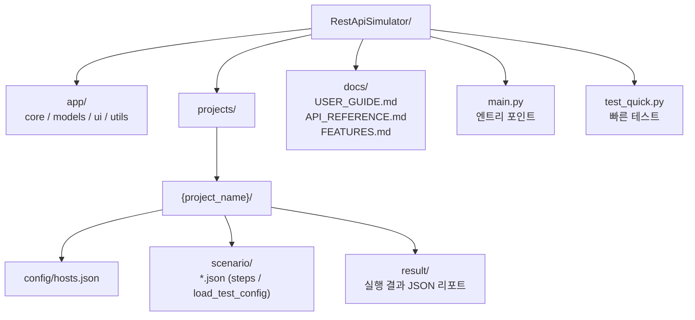

# REST API Simulator

**고급 REST API 시뮬레이터 및 부하 테스트 도구**

Python 기반 TUI(Text User Interface) 애플리케이션으로, REST API 테스트, 부하 테스트, 시나리오 기반 테스트를 수행하는 완전한 솔루션입니다.

## 주요 기능

### 핵심 기능 (요구사항)
1. **프로그램 중복 실행 방지** - PID 기반 락 메커니즘
2. **TUI 기반 인터페이스** - Textual 프레임워크 사용
3. **3단 레이아웃** - 상단(메뉴) + 중간(컨텐츠) + 하단(상태/입력)
4. **프로젝트 관리** - 폴더 기반 프로젝트 구조
5. **시나리오 로딩** - JSON 기반 시나리오 파일
6. **호스트 설정** - JSON 기반 API 호스트 설정
7. **TPS + 부하 테스트** - 고성능 비동기 부하 테스트
8. **시나리오 테스트** - 커스텀 워크플로우 실행
9. **결과 저장** - 상세한 JSON 리포트
10. **UML 생성** - PlantUML 및 ASCII 다이어그램

### 추가 기능 (보완)
11. **실시간 모니터링** - TPS, 응답시간, 에러율 실시간 표시
12. **응답 시간 분석** - P50, P95, P99 백분위수 통계
13. **에러 분석** - 상세한 에러 추적 및 분류
14. **시나리오 검증** - Pydantic 기반 자동 스키마 검증
15. **변수 시스템** - 스텝 간 변수 전달 및 추출
16. **Assertion 엔진** - 10가지 연산자로 응답 검증
17. **재시도 메커니즘** - 스텝별 자동 재시도
18. **조건부 실행** - 실패 시 스킵 옵션
19. **딜레이 제어** - 요청 전/후 대기 시간
20. **동시성 제어** - 최대 동시 요청 수 제한
21. **다중 호스트** - 프로젝트당 여러 호스트 설정
22. **템플릿 제공** - 예제 프로젝트 및 시나리오
23. **상세 리포트** - 메트릭 타임라인 포함
24. **완전한 문서** - 사용자 가이드 및 API 레퍼런스
25. **예제 프로젝트** - 즉시 사용 가능한 샘플


## 전체 아키텍처(컴포넌트) 다이어그램


## “시나리오 실행” 흐름(변수 추출/치환 + Assertion)


## “부하 테스트(TPS)” 실행 구조(목표 TPS + ramp-up + max_concurrent)


## 프로젝트(프로젝트 단위) 파일 구조 다이어그램


## 설치

### 요구사항
- Python 3.10 이상
- pip

### 의존성 설치
```bash
pip install -r requirements.txt
```

### 개발 모드 설치
```bash
pip install -e .
```

## 실행

```bash
# 메인 프로그램 실행
python main.py

# 빠른 테스트 실행
python test_quick.py
```

## 프로젝트 구조

```
RestApiSimulator/
├── app/
│   ├── core/                    # 핵심 비즈니스 로직
│   │   ├── project_manager.py  # 프로젝트 관리
│   │   ├── scenario_engine.py  # 시나리오 실행 엔진
│   │   ├── load_test_engine.py # 부하 테스트 엔진
│   │   ├── http_client.py      # HTTP 클라이언트
│   │   ├── assertion_engine.py # Assertion 검증
│   │   ├── report_generator.py # 리포트 생성
│   │   └── uml_generator.py    # UML 생성
│   ├── models/                  # 데이터 모델
│   │   ├── config.py           # 설정 모델
│   │   ├── scenario.py         # 시나리오 모델
│   │   └── result.py           # 결과 모델
│   ├── ui/                      # TUI 인터페이스
│   │   └── app.py              # 메인 TUI 앱
│   └── utils/                   # 유틸리티
│       └── lock.py             # 프로세스 락
├── projects/                    # 프로젝트 디렉토리
│   └── example/                # 예제 프로젝트
│       ├── config/
│       │   └── hosts.json
│       ├── scenario/
│       │   ├── user_crud.json
│       │   ├── simple_get.json
│       │   └── load_test_scenario.json
│       └── result/             # 결과 저장
├── docs/                        # 문서
│   ├── USER_GUIDE.md           # 사용자 가이드
│   ├── API_REFERENCE.md        # API 레퍼런스
│   └── FEATURES.md             # 기능 목록
├── main.py                      # 메인 엔트리 포인트
├── test_quick.py               # 빠른 테스트 스크립트
├── requirements.txt            # 의존성
└── README.md                   # 이 파일
```

## 사용법

### 1. TUI 실행
```bash
python main.py
```

### 키보드 단축키
- `p`: Projects - 프로젝트 관리
- `s`: Scenarios - 시나리오 실행
- `r`: Results - 결과 보기
- `u`: UML - UML 생성
- `q`: Quit - 종료

### 2. 프로젝트 생성
1. Projects 메뉴 선택
2. `new:<프로젝트명>` 입력

### 3. 시나리오 작성
`projects/{project_name}/scenario/` 폴더에 JSON 파일 생성:

```json
{
  "name": "User CRUD Test",
  "steps": [
    {
      "name": "Create User",
      "method": "POST",
      "path": "/users",
      "body": {"name": "John"},
      "assertions": [
        {"field": "status", "operator": "eq", "value": 201}
      ],
      "extract": {"user_id": "body.id"}
    },
    {
      "name": "Get User",
      "method": "GET",
      "path": "/users/{{user_id}}",
      "assertions": [
        {"field": "status", "operator": "eq", "value": 200}
      ]
    }
  ]
}
```

### 4. 호스트 설정
`projects/{project_name}/config/hosts.json`:

```json
{
  "default": {
    "base_url": "https://api.example.com",
    "timeout": 30,
    "headers": {
      "Content-Type": "application/json"
    },
    "verify_ssl": true
  }
}
```

## 예제 실행

### 시나리오 테스트
```python
from app.core.project_manager import ProjectManager
from app.core.scenario_engine import ScenarioEngine

pm = ProjectManager()
scenario = pm.load_scenario("example", "simple_get")
hosts = pm.load_hosts_config("example")

engine = ScenarioEngine(hosts["default"])
result = await engine.execute_scenario(scenario)
```

### TPS/부하 테스트

시나리오에 `load_test_config`를 추가하여 자동으로 부하 테스트 모드로 실행:

```json
{
  "name": "Load Test Scenario",
  "load_test_config": {
    "duration_seconds": 60,
    "target_tps": 100,
    "ramp_up_seconds": 10,
    "max_concurrent": 50,
    "distribution": "linear"
  },
  "steps": [
    {
      "name": "API Request",
      "method": "GET",
      "path": "/api/endpoint"
    }
  ]
}
```

**부하 테스트 파라미터:**
- `duration_seconds`: 테스트 지속 시간
- `target_tps`: 목표 초당 트랜잭션 수
- `ramp_up_seconds`: 목표 TPS까지 증가 시간
- `max_concurrent`: 최대 동시 요청 수
- `distribution`: 부하 분산 패턴
  - `constant`: 일정한 부하
  - `linear`: 선형 증가
  - `exponential`: 지수 증가

**실시간 메트릭:**
- TPS (Transactions Per Second)
- 응답 시간 (Avg, P50, P95, P99)
- 성공/실패율
- 활성 연결 수

## 문서

- **[사용자 가이드](docs/USER_GUIDE.md)** - 상세한 사용 방법
- **[API 레퍼런스](docs/API_REFERENCE.md)** - 프로그래밍 인터페이스
- **[기능 목록](docs/FEATURES.md)** - 전체 기능 설명

## 테스트

빠른 테스트 실행:

```bash
python test_quick.py
```

이 스크립트는 다음을 테스트합니다:
- 시나리오 실행 및 결과 저장
- UML 생성

## 기술 스택

- **Python 3.10+** - 메인 언어
- **Textual** - TUI 프레임워크
- **httpx** - 비동기 HTTP 클라이언트
- **asyncio** - 비동기 처리
- **Pydantic** - 데이터 검증
- **orjson** - 고성능 JSON 처리
- **psutil** - 프로세스 관리

## 주요 특징

### 고성능
- 비동기 I/O로 높은 처리량
- 효율적인 리소스 사용
- 수천 TPS 지원

### 안정성
- 완전한 에러 핸들링
- 중복 실행 방지
- 안전한 리소스 관리

### 확장성
- 모듈화된 아키텍처
- 플러그인 지원 가능
- 쉬운 커스터마이징

### 사용성
- 직관적인 TUI
- 완전한 문서
- 풍부한 예제

## 고급 기능

### Assertion 연산자
- `eq`, `ne` - 같음/다름
- `gt`, `lt`, `gte`, `lte` - 비교
- `contains`, `not_contains` - 포함
- `in`, `not_in` - 배열 검사
- `regex` - 정규식
- `exists` - 존재 여부

### 변수 시스템
```json
{
  "variables": {"base_url": "/api/v1"},
  "steps": [{
    "path": "{{base_url}}/users",
    "extract": {"user_id": "body.id"}
  }]
}
```

### 부하 분산 패턴
- `constant` - 일정한 부하
- `linear` - 선형 증가
- `exponential` - 지수 증가

## 성능

- **TPS**: 10,000+ (조건에 따라)
- **동시성**: 1,000+ 동시 연결
- **메모리**: 100MB ~ 500MB
- **응답시간**: P99 < 100ms (로컬)

## 트러블슈팅

### 중복 실행 에러
```bash
rm .app.lock
```

### SSL 인증 에러
```json
{"verify_ssl": false}
```

### 타임아웃 에러
```json
{"timeout": 60}
```

## 기여

이슈와 풀 리퀘스트를 환영합니다!

## 라이선스

MIT License

## 제작자

REST API Simulator Team

---

**완벽한 프로그램을 목표로 제작되었습니다**

- 모든 요구사항 구현
- 추가 기능 25개 이상
- 완전한 문서화
- 예제 프로젝트 포함
- 테스트 스크립트 제공
- 버그 방지 설계

